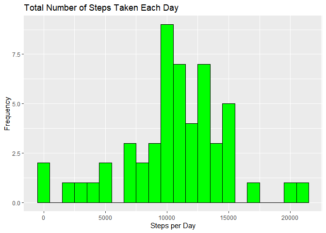

# Reproducible Research-Project 1


   
---


## Change working directory

```r
    setwd("C:/R project/reproducible research/week 2/reproducible")
```
## Code for reading  the dataset and/or processing the data

```r
#install.packages("ggplot2")
#install.packages("dplyr")
#install.packages("lubridate")
   library(ggplot2)
```

```
## Warning: package 'ggplot2' was built under R version 4.1.2
```

```r
   library(dplyr)
```

```
## 
## Attaching package: 'dplyr'
```

```
## The following objects are masked from 'package:stats':
## 
##     filter, lag
```

```
## The following objects are masked from 'package:base':
## 
##     intersect, setdiff, setequal, union
```

```r
   library(lubridate)
```

```
## 
## Attaching package: 'lubridate'
```

```
## The following objects are masked from 'package:base':
## 
##     date, intersect, setdiff, union
```

```r
    fitbit <- read.csv("activity.csv", header=TRUE, na.strings = "NA")
#format the data
    fitbit$date <- ymd(fitbit$date)
#Check the data
    summary(fitbit)
```

```
##      steps             date               interval     
##  Min.   :  0.00   Min.   :2012-10-01   Min.   :   0.0  
##  1st Qu.:  0.00   1st Qu.:2012-10-16   1st Qu.: 588.8  
##  Median :  0.00   Median :2012-10-31   Median :1177.5  
##  Mean   : 37.38   Mean   :2012-10-31   Mean   :1177.5  
##  3rd Qu.: 12.00   3rd Qu.:2012-11-15   3rd Qu.:1766.2  
##  Max.   :806.00   Max.   :2012-11-30   Max.   :2355.0  
##  NA's   :2304
```

```r
    head(fitbit)
```

```
##   steps       date interval
## 1    NA 2012-10-01        0
## 2    NA 2012-10-01        5
## 3    NA 2012-10-01       10
## 4    NA 2012-10-01       15
## 5    NA 2012-10-01       20
## 6    NA 2012-10-01       25
```
## Histogram of the total number of steps taken each day

```r
#summarize the number of step taken daily
    dailysteps <- summarize(group_by(fitbit,date),daily_step=sum(steps))
#create histogram

    hist_1 <- ggplot(data = dailysteps, mapping = aes(x = daily_step)) + geom_histogram(binwidth = 1000,fill = "green", 
    colour = "black") + scale_x_continuous("Steps per Day", ) + 
    scale_y_continuous("Frequency") + ggtitle("Total Number of Steps Taken Each Day")
    hist_1
```

```
## Warning: Removed 8 rows containing non-finite values (stat_bin).
```

<!-- -->

```r
#Calculate mean and median number of step taken each day
    
    mean_steps<-round(mean(dailysteps$daily_step, na.rm = TRUE))
    
    median_steps <-median(dailysteps$daily_step, na.rm = TRUE)
#mean total number of steps taken each day
    mean_steps
```

```
## [1] 10766
```

```r
#median total number of steps taken each day
    median_steps    
```

```
## [1] 10765
```


## What is the average daily activity pattern?

```r
#1. Make a time series plot  of the 5-minute interval (x-axis) and the average number of steps taken, averaged across all days (y-axis)


  aversteps <- aggregate(steps ~interval,  data=fitbit, mean)
  Plotinterval <-plot(aversteps$interval, aversteps$steps,  type="l", xlab="The 5-minute interval ", ylab="Average number steps taken", main="Average Daily Activity Pattern")
```

<!-- -->

```r
  Plotinterval
```

```
## NULL
```

```r
#Which 5-minute interval, on average across all the days in the  dataset, contains the maximum number of steps?
  
  max_interval <-aversteps$interval[which.max(aversteps$steps)]
#The interval of maximum number of steps is:
  max_interval
```

```
## [1] 835
```
## Imputing missing values


```r
#1. Calculate and report the total number of missing values in the dataset 
# The total number of missing value in the data set is:
    
    sum(is.na(fitbit))
```

```
## [1] 2304
```

```r
 #2.   Devise a strategy for filling in all of the missing values in the data set. Using mean steps to fill in the missing data

    
#3. Create a new data set that is equal to the original data set but with the missing data filled in.

    newfit<-fitbit
   # mean_na<-round(mean(newfit$steps, na.rm=TRUE),  digits = 0)
    newfit$steps[is.na(newfit$steps)]<-round(mean(newfit$steps, na.rm=TRUE),  digits = 0)
    
colSums(is.na(newfit))
```

```
##    steps     date interval 
##        0        0        0
```

```r
 #4  Make a histogram of the total number of steps taken each day and calculate and report the mean and median total number of steps taken per day. Do these values differ from the estimates from the first part of the assignment? What is the impact of imputing missing data on the estimates of the total daily number of steps?
    newsteps <- summarize(group_by(newfit,date),imput_step=sum(steps))
    hist_2 <- ggplot(data = newsteps, mapping = aes(x = imput_step)) + geom_histogram(binwidth = 1000, fill = "green", 
    colour = "black") + scale_x_continuous("Steps per Day", ) + 
    scale_y_continuous("Frequency") + ggtitle("Total Number of Steps Taken Each Day")
    hist_2
```

<!-- -->

```r
    mean_impstep<-as.integer(mean(newsteps$imput_step))
#mean of daily steps taken is:
    mean_impstep
```

```
## [1] 10751
```

```r
    median_impste <-median(newsteps$imput_step)
#median of daily step taken is: 
     median_impste
```

```
## [1] 10656
```

```r
# after imputting the missing value, the histogram is more normally distributed.     
```
## Are there differences in activity patterns between weekdays and weekends?


```r
    date_conv <-as.data.frame(weekdays(as.POSIXlt(newfit$date)))
    colnames(date_conv)<-"days"
    date_conv$weekday_1 <-ifelse(date_conv$days == "Saturday" | date_conv$days == "Sunday", "weekend", "weekday") 
    
  

    #create a new data frame
    newmeasure<- cbind.data.frame(newfit, date_conv)
    newmeasure1 <- newmeasure %>% group_by(interval, weekday_1) %>% summarize(mean.step=mean(steps))
```

```
## `summarise()` has grouped output by 'interval'. You can override using the `.groups` argument.
```

```r
    #make plot
    finalplot <- ggplot(data = newmeasure1, mapping = aes(x = interval, y = mean.step, color=weekday_1)) + 
    geom_line() + facet_grid(weekday_1 ~ .)  + scale_x_continuous("5-minutes interval") +
    scale_y_continuous("Average Number of Steps") + ggtitle("Average Number of Steps Taken by Interval")
  finalplot
```

<!-- -->
